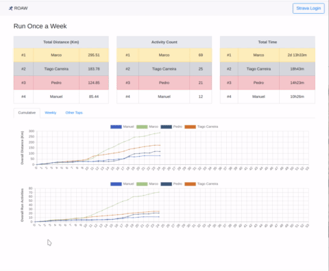
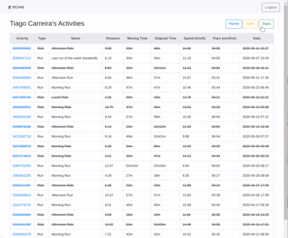
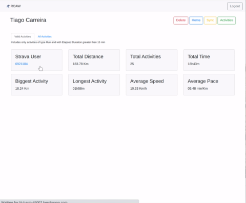

# ROAW - Run Once a Week

Dashboard for statistics and fast comparing with friends' activities on [Strava](https://www.strava.com) over the year.

# Features 

- Statistics dashboard for registered users
- List User's activities
- Auto fetch activities from strava
- Auto register a user on login

## Dashboard

- Simple TOPs table
  - Total running distance 
  - Number of running activities
  - Total running time
  - Biggest run (distance)
  - Longest run (time)
- Graphs (cumulative/weekly)
  - Running distance
  - Number of running activities

## List activities

Paginated list of activities.
Shows also non-running activities

## User statistics

- User statistics (must be logged in) for Running and All activities
  - Strava User (link to Strava User)
  - Total Distance
  - Total Number of Activities 
  - Total Time
  - Biggest Activity (distance)
  - Longest Activity (time)
  - Average Speed
  - Average Pace

# Motivation

This project started from a challenge to run every week. 

This quickly become a competition. 
And every competition deserves a dashboard!

# Deploy your own version on Heroku

- Clone this repository
- Setup [Buffalo](https://gobuffalo.io) and [Heroku](https://www.heroku.com/)
- run `buffalo plugins install`
- Get Strava APP credentials (https://www.strava.com/settings/api)
- Setup heroku environment `heroku config:set ROAW_YEAR=<year> STRAVA_KEY=<strava_app_key> STRAVA_SECRET=<strava_app_secret>`
- run `buffalo heroku deploy`

# Development

This project is [Powered by Buffalo](http://gobuffalo.io).

- Clone this repository
- Setup [Buffalo](https://gobuffalo.io) and [Heroku](https://www.heroku.com/)
- run `buffalo plugins install`
- Setup your own database (postgreSQL is recommended)
  - edit `database.yml`
- run `buffalo setup` 
- launch dev server `buffalo dev`
- open your browser on [http://127.0.0.1:3000](http://127.0.0.1:3000)

# Contribution

Feel free to open issues and Pull Requests are welcomed.